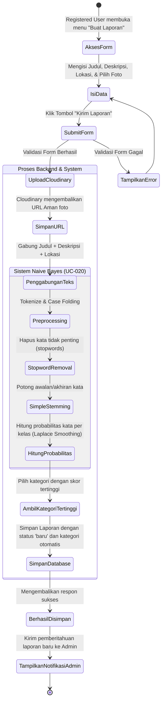
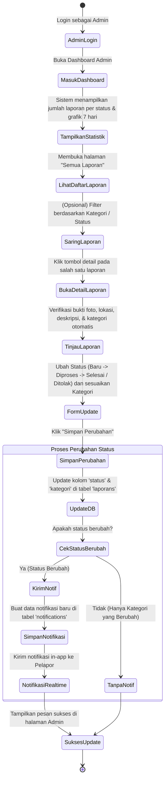
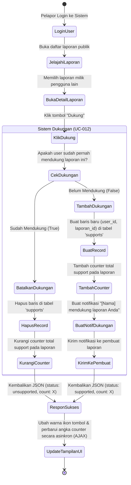
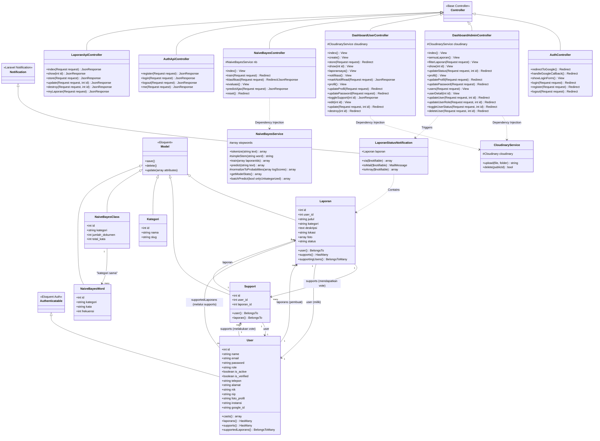

# Perencanaan Desain Sistem: LaporanKita (Sistem Informasi Pengaduan Masyarakat)

Dokumen ini berisi perencanaan **Use Case Diagram**, **Activity Diagram**, dan **Class Diagram** untuk project **LaporanKita** berdasarkan kode backend Laravel yang sedang berjalan.

---

## 📊 1. Use Case Diagram

Use Case Diagram menggambarkan interaksi antara aktor (pengguna/sistem eksternal) dengan fungsionalitas yang disediakan oleh sistem LaporanKita.

### Aktor Sistem:
1. **Guest/Public User (Masyarakat Umum)**: Pengguna yang belum terdaftar/login. Hanya dapat melihat laporan publik.
2. **Registered User (Pelapor)**: Pengguna yang sudah masuk. Dapat membuat laporan pengaduan, mengedit laporan (jika status masih Baru), memberikan dukungan (vote/support), serta melihat riwayat pengaduan dan notifikasi mereka.
3. **Admin (Petugas/Instansi)**: Pengguna dengan akses dashboard admin. Bertugas mengelola pengaduan, mengubah status penanganan, memverifikasi kategori, serta mengelola akun pengguna (manajemen user).
4. **System (Mesin/Layanan)**:
   - **Naive Bayes Classification Engine**: Melakukan klasifikasi otomatis kategori pengaduan.
   - **Cloudinary Storage**: Layanan penyimpanan foto pengaduan.
   - **Notification Service**: Mengirim notifikasi perubahan status/dukungan.

### Visualisasi Use Case (Mermaid)

```mermaid
graph TB
    %% Aktor
    subgraph Aktor["👥 Aktor"]
        Guest["👤 Guest User"]
        User["👤 Registered User<br>(Pelapor)"]
        Admin["👨‍💼 Admin"]
        System["🤖 System Components"]
    end

    %% Fungsionalitas
    subgraph Sub_Auth["🔐 Autentikasi & Akun"]
        UC01["UC-001: Registrasi Akun"]
        UC02["UC-002: Login Email/Password"]
        UC03["UC-003: Login Google OAuth"]
        UC04["UC-004: Logout"]
        UC05["UC-005: Kelola Profil & Kata Sandi"]
    end

    subgraph Sub_Laporan["📝 Manajemen Pengaduan"]
        UC06["UC-006: Membuat Laporan Baru"]
        UC07["UC-007: Melihat Daftar Laporan (Publik)"]
        UC08["UC-008: Melihat Detail Laporan"]
        UC09["UC-009: Melihat Laporan Saya"]
        UC10["UC-010: Mengubah Laporan (Status: Baru)"]
        UC11["UC-011: Menghapus Laporan (Status: Baru)"]
    end

    subgraph Sub_Support["👍 Sistem Dukungan (Voting)"]
        UC12["UC-012: Memberikan/Membatalkan Dukungan"]
        UC13["UC-013: Melihat Daftar Pendukung"]
    end

    subgraph Sub_Admin["⚙️ Dashboard & Panel Admin"]
        UC14["UC-014: Melihat Statistik Dashboard"]
        UC15["UC-015: Melihat Semua Laporan (Admin)"]
        UC16["UC-016: Menyaring (Filter) & Mencari Laporan"]
        UC17["UC-017: Meninjau Detail Laporan (Admin)"]
        UC18["UC-018: Memperbarui Status & Kategori"]
        UC19["UC-019: Manajemen Akun Pengguna (Manajemen User)"]
    end

    subgraph Sub_ML["🤖 Otomatisasi Sistem"]
        UC20["UC-020: Klasifikasi Kategori Otomatis (Naive Bayes)"]
        UC21["UC-021: Mengirim Notifikasi Perubahan Status"]
        UC22["UC-022: Mengirim Notifikasi Dukungan Laporan"]
    end

    %% Relasi Guest
    Guest --> UC01
    Guest --> UC02
    Guest --> UC03
    Guest --> UC07
    Guest --> UC08

    %% Relasi Registered User
    User --> UC04
    User --> UC05
    User --> UC06
    User --> UC07
    User --> UC08
    User --> UC09
    User --> UC10
    User --> UC11
    User --> UC12
    User --> UC13

    %% Relasi Admin
    Admin --> UC04
    Admin --> UC05
    Admin --> UC14
    Admin --> UC15
    Admin --> UC16
    Admin --> UC17
    Admin --> UC18
    Admin --> UC19

    %% Hubungan Include & Extend
    UC06 -.->|includes| UC20
    UC18 -.->|includes| UC21
    UC12 -.->|includes| UC22

    %% Hubungan System
    System --> UC20
    System --> UC21
    System --> UC22
```

---

## 🔄 2. Activity Diagram

Activity Diagram memodelkan alur kerja (workflow) dinamis dari proses bisnis utama di dalam sistem.

### A. Alur Pembuatan Laporan & Klasifikasi Otomatis
Menjelaskan bagaimana Registered User membuat laporan, sistem mengunggah foto ke Cloudinary, memproses teks dengan Naive Bayes untuk penentuan kategori otomatis, lalu menyimpannya.

### B. Alur Tindak Lanjut & Perubahan Status Laporan oleh Admin
Menjelaskan alur kerja admin saat meninjau laporan masuk, memverifikasi/mengubah kategori, memperbarui status pengaduan, dan memicu notifikasi real-time untuk pelapor.

### C. Alur Memberikan Dukungan (Support/Vote Laporan)
Menjelaskan bagaimana seorang pengguna terdaftar dapat mendukung laporan pengguna lain (atau membatalkannya), dan bagaimana sistem mengupdate total dukungan secara dinamis.

---

## 📐 3. Class Diagram

Class Diagram di bawah ini dirancang berdasarkan struktur kode riil Laravel di project ini, mencakup relasi Eloquent Model, Controller, Service Helper, dan Notification.

### Visualisasi Class Diagram (Mermaid)

---

## 💡 Rangkuman Aliran Data Utama

1. **Pengajuan Pengaduan**:
   - `DashboardUserController::store` -> Memanggil `CloudinaryService::upload` untuk mengunggah berkas gambar.
   - `LaporanApiController::store` atau `DashboardUserController::store` -> Memanggil database untuk menyimpan data laporan.
   - Bersamaan dengan itu, `NaiveBayesService::predict` menganalisis teks untuk menentukan kategori laporan secara cerdas.
2. **Dukungan (Support)**:
   - `DashboardUserController::toggleSupport` memanipulasi baris data `Support` dan memperbarui counter. Jika terjadi dukungan baru, notifikasi dibuat dan disimpan.
3. **Pemberitahuan**:
   - Admin mengubah status laporan via `DashboardAdminController::updateStatus`. Ini memicu instansiasi `LaporanStatusNotification` yang terikat pada `User` pembuat pengaduan.
