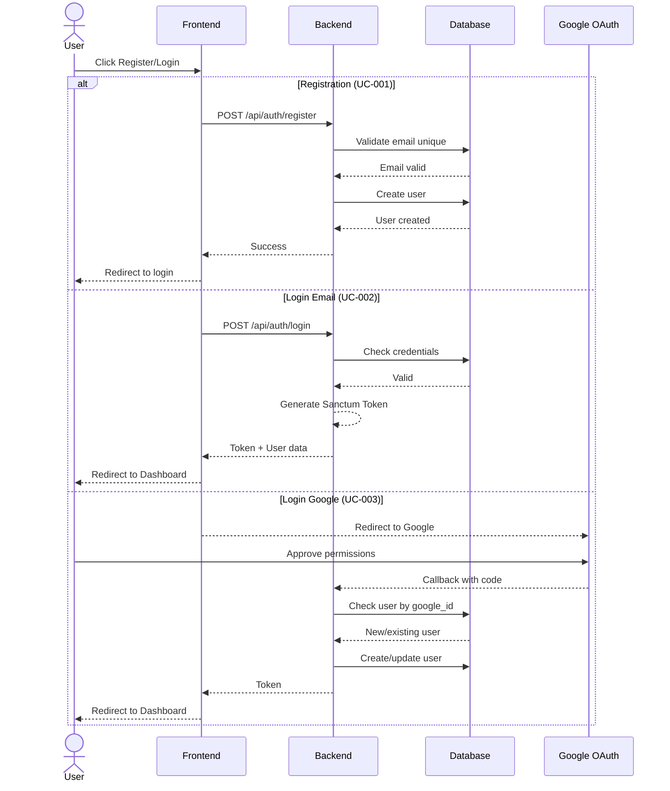
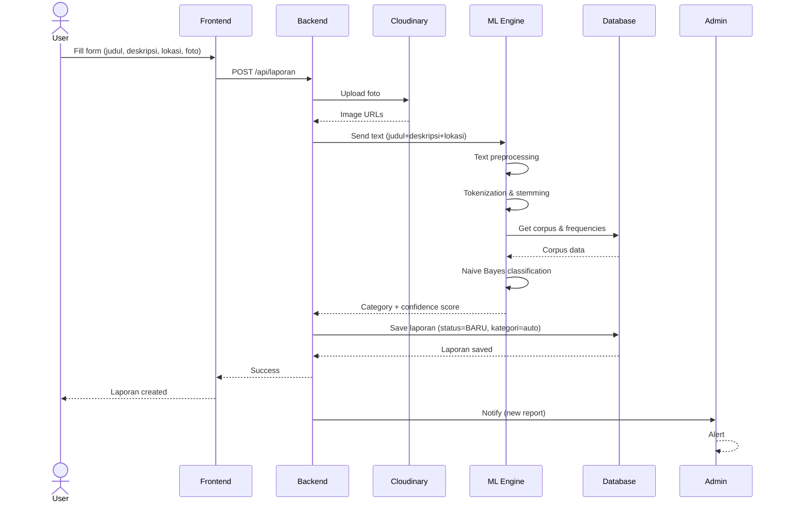
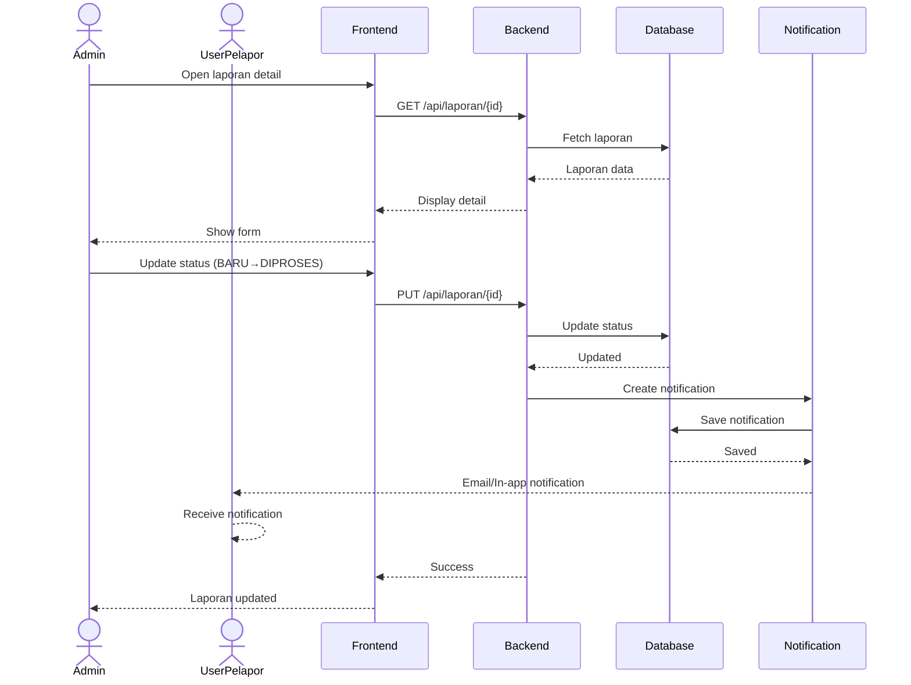
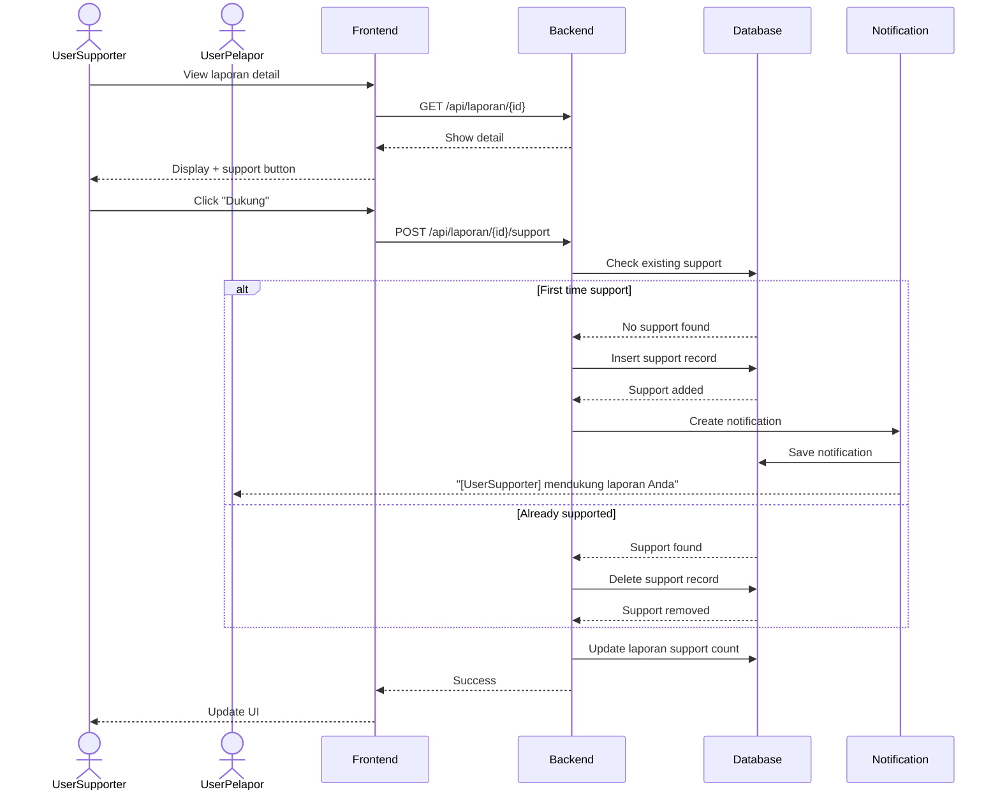
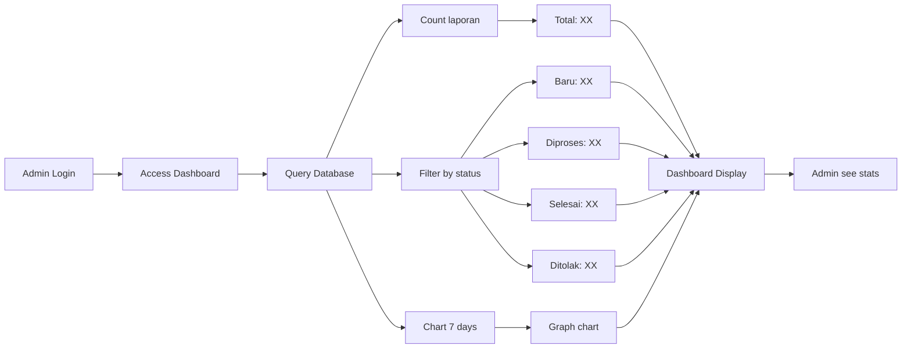

# Use Case Diagram & Workflow Visualization
## Project LaporanKita

---

## 📊 Use Case Diagram (Mermaid)

```mermaid
graph TB
    subgraph Actors["👥 ACTORS"]
        A["👤 Guest User"]
        B["👤 Registered User"]
        C["👨‍💼 Admin"]
        D["🤖 System"]
    end
    
    subgraph Authentication["🔐 AUTHENTICATION & ACCOUNT"]
        UC1["UC-001: Register"]
        UC2["UC-002: Login Email/Password"]
        UC3["UC-003: Login Google OAuth"]
        UC4["UC-004: Logout"]
        UC5["UC-005: View Profile"]
    end
    
    subgraph Laporan["📝 LAPORAN MANAGEMENT"]
        UC6["UC-006: Create Laporan"]
        UC7["UC-007: View All Laporan"]
        UC8["UC-008: View Detail Laporan"]
        UC9["UC-009: View My Laporan"]
        UC10["UC-010: Update/Edit Laporan"]
        UC11["UC-011: Delete Laporan"]
    end
    
    subgraph Support["👍 SUPPORT SYSTEM"]
        UC12["UC-012: Support Laporan"]
        UC13["UC-013: View Supporter List"]
    end
    
    subgraph AdminPanel["⚙️ ADMIN MANAGEMENT"]
        UC14["UC-014: View Dashboard"]
        UC15["UC-015: View All Laporan"]
        UC16["UC-016: Filter Laporan"]
        UC17["UC-017: View Laporan Detail"]
        UC18["UC-018: Update Status"]
    end
    
    subgraph ML["🤖 ML & NOTIFICATIONS"]
        UC19["UC-019: Auto-Classify"]
        UC20["UC-020: Send Status Notification"]
        UC21["UC-021: Send Support Notification"]
    end
    
    A -->|UC1| UC1
    A -->|UC2/UC3| UC2
    A -->|UC2/UC3| UC3
    A -->|UC7/UC8| UC7
    A -->|UC7/UC8| UC8
    
    B -->|UC2| UC2
    B -->|UC4| UC4
    B -->|UC5| UC5
    B -->|UC6| UC6
    B -->|UC7/UC8/UC9| UC7
    B -->|UC7/UC8/UC9| UC8
    B -->|UC7/UC8/UC9| UC9
    B -->|UC10| UC10
    B -->|UC11| UC11
    B -->|UC12/UC13| UC12
    B -->|UC12/UC13| UC13
    
    C -->|UC2| UC2
    C -->|UC4| UC4
    C -->|UC14| UC14
    C -->|UC15| UC15
    C -->|UC16| UC16
    C -->|UC17| UC17
    C -->|UC18| UC18
    
    D -->|triggered| UC6
    D -->|triggered| UC19
    D -->|triggered| UC12
    D -->|triggered| UC18
    D -->|triggered| UC20
    D -->|triggered| UC21
    
    UC6 -->|triggers| UC19
    UC19 -->|set category| UC6
    UC18 -->|triggers| UC20
    UC12 -->|triggers| UC21
    
    style Actors fill:#FFE5B4
    style Authentication fill:#B4E5FF
    style Laporan fill:#B4FFB4
    style Support fill:#FFB4E5
    style AdminPanel fill:#E5B4FF
    style ML fill:#FFE5B4
```



---

## 🔄 System Flow Diagrams

### **Flow 1: User Registration & Login Flow**


### **Flow 2: Create Laporan with Auto-Classification**


### **Flow 3: Admin Status Update with Notification**


### **Flow 4: Support Laporan**


### **Flow 5: Admin Dashboard Statistics**


---

## 🎯 Entity Relationship Diagram (ERD)

```mermaid
erDiagram
    USERS ||--o{ LAPORAN : "creates"
    USERS ||--o{ SUPPORT : "gives"
    USERS ||--o{ NOTIFICATION : "receives"
    LAPORAN ||--o{ SUPPORT : "receives"
    LAPORAN }o--|| KATEGORI : "belongs_to"
    LAPORAN }o--o{ USERS : "supported_by"
    NAIVEBAYESCLASS ||--o{ NAIVEBAYESWORD : "contains"
    LAPORAN }o--|| NAIVEBAYESCLASS : "classified_as"
    
    USERS {
        int id PK
        string name
        string email UK
        string password
        enum role
        boolean is_active
        boolean is_verified
        string telepon
        string alamat
        string nik
        string nip
        string foto_profil
        string instansi
        string google_id
        timestamps
    }
    
    LAPORAN {
        int id PK
        int user_id FK
        string judul
        string kategori
        text deskripsi
        string lokasi
        json foto
        enum status
        timestamps
    }
    
    SUPPORT {
        int id PK
        int user_id FK
        int laporan_id FK
        timestamps
    }
    
    KATEGORI {
        int id PK
        string nama_kategori
        text deskripsi
    }
    
    NOTIFICATION {
        int id PK
        int user_id FK
        json data
        datetime read_at
        timestamps
    }
    
    NAIVEBAYESCLASS {
        int id PK
        string class_name
        int total_documents
    }
    
    NAIVEBAYESWORD {
        int id PK
        string word
        int class_id FK
        int frequency
    }
```

---

## 📋 Use Case Matrix

| UC # | Use Case | Actor | Sistem | Trigger | Priority |
|------|----------|-------|--------|---------|----------|
| 001 | Register | Guest → User | Auth | User action | HIGH |
| 002 | Login Email | Guest → User | Auth | User action | HIGH |
| 003 | Login Google | Guest → User | Auth | User action | HIGH |
| 004 | Logout | User → Guest | Auth | User action | MEDIUM |
| 005 | View Profile | User | Profile | User action | MEDIUM |
| 006 | Create Laporan | User | Laporan | User action | HIGH |
| 007 | View All Laporan | Any | Laporan | User action | HIGH |
| 008 | View Laporan Detail | Any | Laporan | User action | HIGH |
| 009 | View My Laporan | User | Laporan | User action | MEDIUM |
| 010 | Edit Laporan | User | Laporan | User action | MEDIUM |
| 011 | Delete Laporan | User/Admin | Laporan | User action | MEDIUM |
| 012 | Support Laporan | User | Support | User action | HIGH |
| 013 | View Supporter List | Any | Support | User action | LOW |
| 014 | View Dashboard Admin | Admin | Dashboard | User action | HIGH |
| 015 | View All Laporan (Admin) | Admin | Laporan | User action | HIGH |
| 016 | Filter Laporan | Admin | Laporan | User action | HIGH |
| 017 | View Detail (Admin) | Admin | Laporan | User action | HIGH |
| 018 | Update Status | Admin | Laporan | User action | HIGH |
| 019 | Auto-Classify (Naive Bayes) | System | ML | UC-006 trigger | HIGH |
| 020 | Send Status Notification | System | Notification | UC-018 trigger | HIGH |
| 021 | Send Support Notification | System | Notification | UC-012 trigger | MEDIUM |

---

## 🔐 Security Considerations

| Aspek | Implementasi |
|-------|---------------|
| **Authentication** | Laravel Sanctum (Bearer Token) |
| **Password** | Hash bcrypt, minimum 8 character |
| **OAuth** | Google OAuth 2.0, secure redirect |
| **Authorization** | Role-based (admin/user) |
| **File Upload** | Cloudinary (secure CDN) |
| **Input Validation** | Form request validation di backend |
| **SQL Injection** | ORM Eloquent protection |
| **CSRF** | Laravel CSRF middleware |
| **API Rate Limiting** | Can be added if needed |

---

## ✅ Development Checklist

### Phase 1: Authentication ✅
- [x] Register endpoint
- [x] Login endpoint
- [x] Google OAuth integration
- [x] Token generation (Sanctum)
- [x] Logout endpoint

### Phase 2: Laporan Management ✅
- [x] Create laporan
- [x] View all laporan
- [x] View laporan detail
- [x] Update laporan
- [x] Delete laporan
- [x] Photo upload to Cloudinary

### Phase 3: Auto-Classification ✅
- [x] Naive Bayes implementation
- [x] Text preprocessing
- [x] Tokenization & stemming
- [x] Training data collection
- [x] Auto-categorization on create

### Phase 4: Support System ✅
- [x] Support/vote mechanism
- [x] Support counter
- [x] Supporter list

### Phase 5: Admin Dashboard ⏳
- [x] Dashboard view
- [x] Statistics display
- [x] Laporan list
- [x] Filter functionality
- [x] Detail view
- [ ] Status update with validation
- [ ] Bulk operations (optional)

### Phase 6: Notifications ⏳
- [x] Notification model
- [ ] Status change notifications
- [ ] Support notifications
- [ ] Email notifications (optional)

### Phase 7: API Documentation 📝
- [ ] Postman collection completion
- [ ] API documentation
- [ ] Error handling standardization
- [ ] Response format standardization

---

**Diagram updated: 3 Juni 2026**
